# Mini Processor SPI

- Lucas da Paz Oliveira;
- Rodrigo Miotto Slongo.

## Índice

- [Visão Geral](#visão-geral);
- [Estrutura do Projeto](#estrutura-do-projeto);
- [Simulação](#simulação);
- [Formas de Onda](#formas-de-onda).

## Visão Geral

Este trabalho tem como objetivo a implementação, em System Verilog, de um mini processador com 4 instruções. A
comunicação do processador com a ALU (_arithmetic logic unit_) deve ser implementada utilizando o protocolo SPI e as
operações só devem ser realizadas após toda a informação ser transmitida.

## Estrutura do Projeto

- [docs](./docs/): Documentação e enunciado do trabalho;
- [interface](./interface/): Interfaces;
- [rtl](./rtl/): Descrição de _hardware_;
- [sim](./sim/): _Testbenches_ e _scripts_ de simulação;

## Simulação

A forma mais tradicional de executar a simulação é acessar o diretório [**sim/**](./sim/) e executar o comando `vsim`
passando o arquivo [`sim.do`](./sim/sim.do):

```sh
cd ./sim/
vsim -do sim.do
```

Alternativamente, é possível utilizar os _scripts_ [`compile.sh`](./compile.sh) para compilar os arquivos fonte,
verificando se há erros ou _warnings_, e [`run.sh`](./run.sh) para executar a simulação. Estes _scripts_ devem ser
executados a partir do [**diretório raiz**](./).

> [!important]
> É imprescindível que cada comando seja rodado a partir do diretório especificado nesta documentação; caso contrário,
> o caminho dos códigos fontes e _scripts_ necessários para a execução não será encontrado. Se for executar diretamente
> o comando `vsim -do sim.do`, acesse o diretório [**sim/**](./sim/); caso deseje utilizar os _scripts_
> [`compile.sh`](./compile.sh) ou [`run.sh`](./run.sh), execute-os a partir do [**diretório raiz**](./).

O [_testbench_](./sim/ProcessorTb.sv) possui diversas instruções que serão executadas e validadas; utilizou-se
`$display` para mostrar a execução de cada uma. A simulação também executa uma forma de onda, disponível em
[`wave.do`](./sim/wave.do); este _script_ separa os sinais por módulos e realiza as configurações necessárias para a
melhor visualização possível do diagrama de formas de onda gerado pela execução da simulação.


## Formas de Onda

Nesta seção serão apresentadas as formas de onda simuladas para cada operação implementada.

### `ADD`

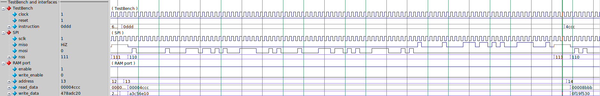
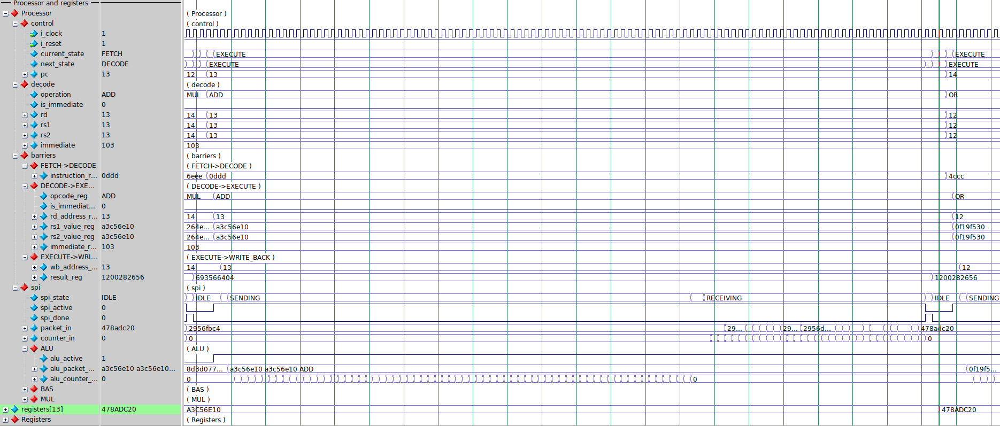
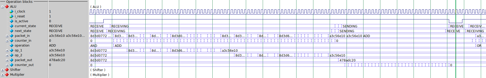

### `AND`

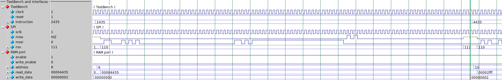
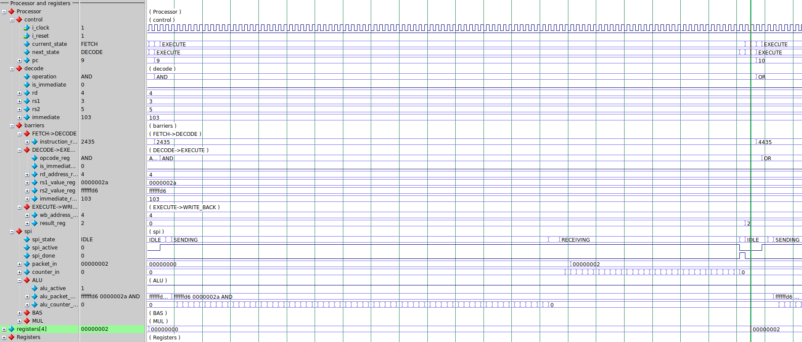
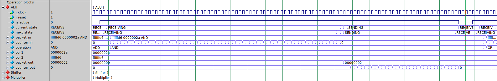

### `OR`

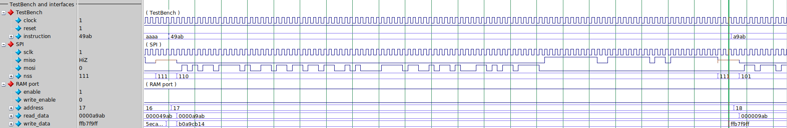
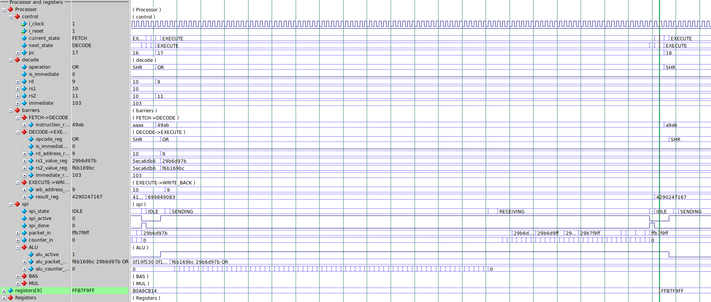
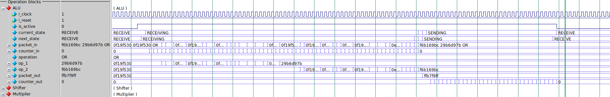

### `MUL`

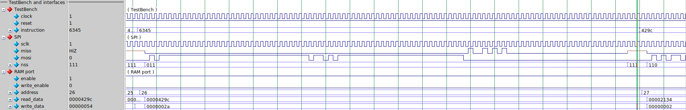
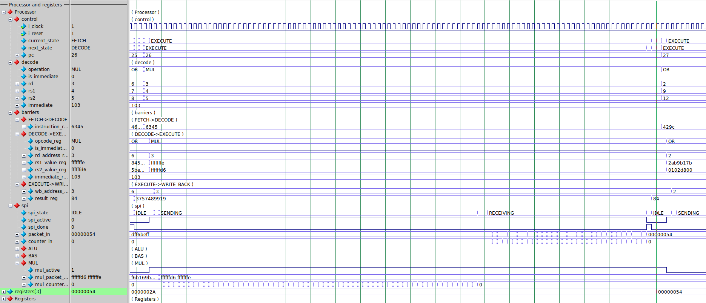
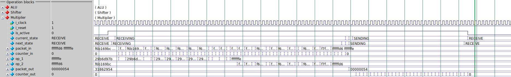

### `SHL`

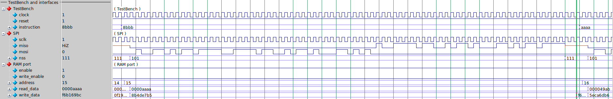
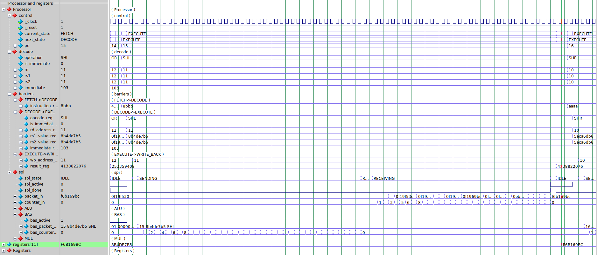
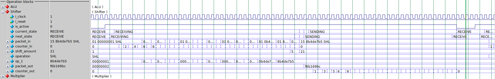

### `SHR`

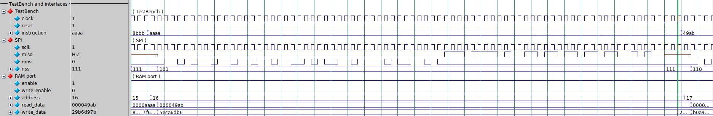
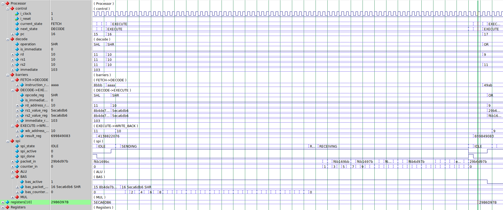
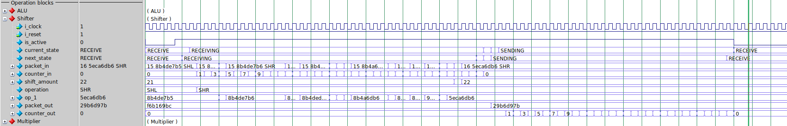

### `LW`

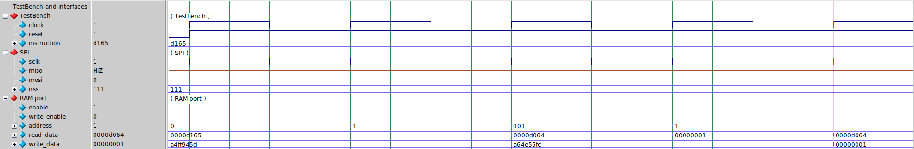
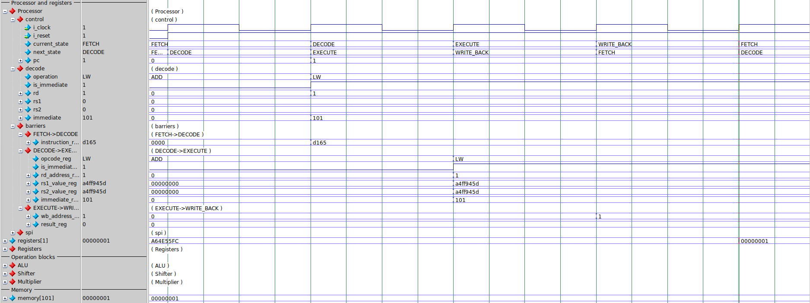

### `SW`

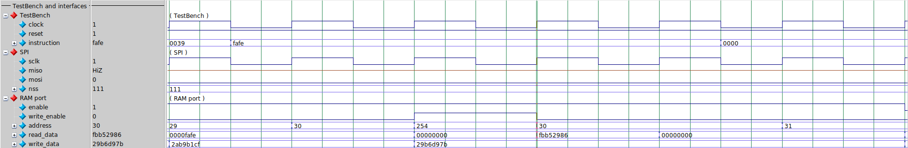
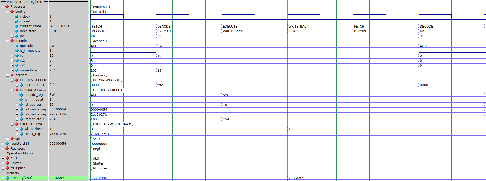
